# 🧠 SentiAid – Speech to Animated Sign Language Interpreter

**SentiAid** is an AI-powered solution designed to bridge the communication gap between the Deaf and Hard-of-Hearing (DHH) community and the hearing world. Our system converts **spoken or textual input** into **real-time animated Indian Sign Language (ISL)** using deep learning, keypoint detection, and pose-based animation.

> 🌐 **Built With**: TensorFlow, Mediapipe, VideoMAE, LangGraph, LangChain, Transformers, IndicTrans2, LLM Agentic Frameworks

---

## 🚀 Project Objective

Develop a robust, scalable, and inclusive AI pipeline that:

* Converts **speech or text to ISL**
* Animates signs using pose/keypoint-based avatars
* Supports **22 Indian languages** (Scheduled)
* Ensures **accessibility** in education, workplaces, and public spaces

---

## ✨ Key Features

* 🎙️ **Speech-to-Text**: Using Whisper or IndicTTS
* 📝 **Text-to-Gloss**: With LangGraph + Agentic LLMs
* 🔁 **Gloss-to-ISL Poses**: Generated using masked motion templates
* 🧍‍♂️ **Avatar Animation**: Via Mediapipe keypoints and Blender/Three.js
* 🌐 **Multilingual Support**: Enabled by IndicTrans2
* 📱 **Cross-Platform UI**: Accessibility-first mobile-friendly web app

---

## 🧠 System Architecture

```mermaid
graph TD
  A[Speech Input] --> B[Whisper / IndicTTS]
  B --> C[Text Output]
  C --> D[LangGraph LLM Agent → Gloss]
  D --> E[Gloss → Pose Sequence Model LSTM/Transformer]
  E --> F[Masked Pose Templates + ISL Mapping]
  F --> G[Animated Avatar Three.js / Blender / Mediapipe]
```



---

## 📊 Dataset: INCLUDE

**[INCLUDE Dataset – Zenodo](https://zenodo.org/records/4010759)**
Provided by AI4Bharat, this dataset contains 4,292 videos of ISL signs:

* **Training Set**: 3,475 videos
* **Testing Set**: 817 videos
* Each video captures a single ISL sign, performed by deaf students from St. Louis School for the Deaf, Adyar, Chennai.

---

## 🔍 Model Architectures

### 1. **LSTM-Based Model** (Dynamic Gesture Learning)

* **Input**: Mediapipe-extracted pose keypoints
* **Architecture**:

  * `TimeDistributed(Dense)` to extract spatial patterns
  * `LSTM` layers to capture temporal gesture transitions
* **Use Case**: Classifying ISL signs from real-time keypoints

### 2. **Transformer-Based Model** (Context-Aware)

* **Backbone**: Adapted from [VideoMAE](https://arxiv.org/abs/2203.12602)
* **Features**:

  * Warmup Scheduler for stable convergence
  * `AdamW` optimizer for generalization
  * `ReduceLROnPlateau` for dynamic learning rates
  * Finetuning on temporal gesture datasets

---

## 🎯 Dual-Mode Solution Approach

### 1. **Sign ➡️ Text**

* **Pipeline**:

  * Video input → Pose extraction (Mediapipe)
  * Pose → Classifier (LSTM/Transformer)
  * Classification → Text (via LangChain Agent)

### 2. **Text ➡️ Sign**

* **Pipeline**:

  * Natural Language Input → Gloss (LLM Agent)
  * Gloss → Pose Templates (masked sequences)
  * Output: 3D animated ISL avatar

---

## ✅ Current Progress

* ✅ LSTM model for ISL recognition
* ✅ Transformer encoder tested on INCLUDE dataset
* ✅ Agentic LangChain pipeline integrated
* ✅ Gloss-to-Pose pipeline functioning
* ✅ Accessibility-focused multilingual web app live: [https://www.sentiaid.co.in/](https://www.sentiaid.co.in/)

---

## 🔭 Future Roadmap

### 🔧 Model Optimization

* Benchmark LSTM and Transformer on dynamic sign sequences
* Develop a **hybrid model**: Local (LSTM) + Global (Transformer)
* Apply quantization and ONNX conversion for **real-time inference**

### 🧾 Dataset Expansion

* Add ISL phrases from **banking, health, education**
* Include **regional ISL dialects**
* Capture **facial cues, expressions, and gaze data**

### 📱 Mobile App & Accessibility

* Merge Speech → Text → Sign flow in app
* Enable **offline functionality**
* Real-time 3D avatar rendering (WebGL/Blender pipeline)

### 🛠️ API / SDK Development

* Public **REST API** for ISL translation
* **Plug-and-play SDKs** for EdTech & HR applications

### 📋 Research & Publishing

* Submit papers to **ACL, COLING, EMNLP**
* Comparative study: LSTM vs Transformer for gesture decoding

---

## 🔗 Key Resources

* 📊 [INCLUDE Dataset (Zenodo)](https://zenodo.org/records/4010759)
* 🧠 [VideoMAE (HuggingFace)](https://huggingface.co/MCG-NJU/videomae-base)
* 🇮🇳 [AI4Bharat NLP Models](https://huggingface.co/ai4bharat)
* 🧬 [LangChain Documentation](https://python.langchain.com/docs/)
* 🤖 [LangGraph Agentic Workflows](https://python.langchain.com/docs/langgraph/)
* 🧏 [ISLRTC – History of Indian Sign Language](https://islrtc.nic.in/history-0)

---

## 💡 Example Code: LSTM Pose Classifier (Simplified)

```python
from tensorflow.keras.models import Sequential
from tensorflow.keras.layers import TimeDistributed, Dense, LSTM, Dropout

def create_lstm_model(input_shape, num_classes):
    model = Sequential()
    model.add(TimeDistributed(Dense(128), input_shape=input_shape))
    model.add(Dropout(0.3))
    model.add(LSTM(64, return_sequences=True))
    model.add(LSTM(32))
    model.add(Dense(64, activation='relu'))
    model.add(Dense(num_classes, activation='softmax'))
    return model

# Example usage:
# input_shape = (sequence_length, num_keypoints)
# num_classes = total number of ISL signs in your dataset
```

---

> **SentiAid** is committed to transforming accessibility through intelligent, inclusive technology — giving a voice to gestures and empowering the Deaf and Hard-of-Hearing community across India.

---

Would you like me to help design your **research paper**, **poster**, or a **pitch deck** using this summary?
